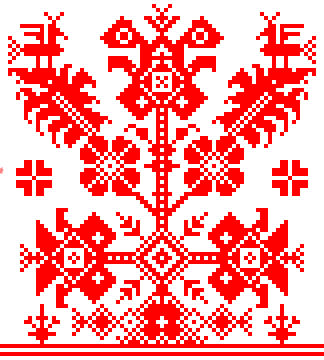

## Russian National Electronic Library - MetaData Integration System (SEED)

_(ex unified NDL/RSL/NEL Catalogue system)_



Provided by [Russian National electronic Library](https://rusneb.ru) ([Wiki](https://ru.wikipedia.org/wiki/Национальная_электронная_библиотека)/[NEL](https://en.wikipedia.org/wiki/National_electronic_library))  operator: [Russian State Library](https://rsl.ru).

Maintainer: [Ilya Kutukov](mailto:KutukovIB@rsl.ru) [i@leninka.ru](mailto:i@leninka.ru) (RSL _R&D Lab_ / RSL _Knowledge engineering Dpt_).

## Environment expectations

### ports:
- `8080` `3080` Public OAPI3 OPDS2 Catalogue
- PostgreSQL should be available to the container `5432` port from outside

### PostgreSQL sidecar configuration: 

```yaml
host: "localhost"
user: "rsl"
password: "rsl"
database: "rsl"
port: 5432
```

## Running

Service is expected to be deployed with docker.

Reference compose file is provided as `/stack.yaml` located at repo root.

Shortest path to get up and running (with docker and docker-compose pre-requisites) is:

```
$ git clone https://gitlab.rsl.ru/neb/neb-catalog.git
$ cd ./neb-catalog
$ npm run start:docker
```

To run service container build only use:

```sh
$ npm run build:docker
```
#### Development version

To run local development version use
```
$ git clone https://gitlab.rsl.ru/neb/neb-catalog.git
$ cd ./neb-catalog
$ npm install
$ psql -f ./src/__tests__/bootstrap_test_posgtre_10.sql
$ npm run bootstrap
$ npm start
```

PostgreSQL >= 10.x is required for all work mode except run with `--stat` flag against metadata dumps (`.mrc` is supposed)

Basic PostgreSQL configuration could be found in `/src/contants.js` in `PG_CONN_CRED` variable.

Also Postgre could be configured with environment variables:

- `POSTGRES_HOST` (default: "`localhost`")
- `POSTGRES_PORT` (default: `5432`)
- `POSTGRES_USER` (default: "`rsl`")
- `POSTGRES_PASSWORD` (default "`rsl`")
- `POSTGRES_DB` (default "`rsl`")

## Catalog service configuration

Launch point:

```
$ npm run start
```

ENV Variables:

- `SEED_CATALOG_BASE_URI` - Public access point address (default: `https://cataalog.rusneb,ru/`, _trailing slash ishighly recommended!_)
- `SEED_CATALOG_SCHEME` - Internal service HTTP endpoint scheme (default: `http`)
- `SEED_CATALOG_DEFAULT_SCHEME` - Default scheme for external links without scheme (default: `https`)
- `SEED_CATALOG_HOST` - Internal service HTTP endpoint host (default: `localhost`)
- `SEED_CATALOG_PORT` - Internal service HTTP endpoint port (default: `8080`)
- `SEED_OPDS2_DEFAULT_PAGE_SIZE` - Default page size (default: 100)
- `SEED_OPDS2_MAX_PAGE_SIZE` - Max page size (default: 10000)
- `SEED_CATALOG_LANGUAGE` - OPDS catalog language (default: 'ru')
- `SEED_CATALOG_STATIC_PATH` - Local static files location
- `SEED_CATALOG_CACHE_PATH` - Path for a lightweight DB with OPDS2 catalog rendered records (default: app codebase root) 
- `DEBUG` - Debug mode (default: None)
- `DEBUG_DB` - Flush all DB SQL requests history to both `stdout` and `stderr`. Don't depend on `DEBUG` option and _not getting enabled_ when `DEBUG=1` (default: None)

## Pagination:

Pagination evaluates cursor-based mechanics and compatible with [Facebook Graph Pagination API](https://developers.facebook.com/docs/graph-api/using-graph-api/#paging) with respect to [OPDS2 Catalog draft - 3. Pagination](https://drafts.opds.io/opds-2.0.html#3-pagination) standard.

So its relying on following set of parameters:

| Name | Description |
| --- | --- |
| `before` | Cursor that points to the start of the current page (first record). |
| `after` | Сursor that points to the end of the current page (last record). |
| `limit` | This is the maximum number of objects to return returned. |
          |  It is possible ro receive less than limit due performance or access reasons, but all pagination links, that supposed to be valid. |
          |  The major hallmarck of data pages exhaust - is the absence of the `next` link |
| `next` | URL that supposed to return next page of data. It is possible for intermediate pages to be empty. Absence of the `next` link means that cursor traverse is over. |


```JSON
{
  "metadata": {
    "title": "Page of feed",
    "cursors": {
      "after": "F157-17344",
      "before": "1457-I7344"
    },
    "numberOfPageItems": 3 
  },
  "navigation": [
    {
      "rel": "next",
      "href": "https://catalog.rusneb,ru/resources/item.json?limit=100&after=1457-I7344",
      "type": "application/opds+json"
    },
    {
      "rel": "first",
      "href": "https://catalog.rusneb,ru/resources/item.json?limit=100",
      "type": "application/opds+json"
    }
  ],
  "publications": [
     {"some": "..."},
     {"some": "..."},
     {"some": "..."}
  ],
  "links": [
    {
      "rel": "self",
      "href": "https://catalog.rusneb,ru/resources/item.json?limit=100&after=F157-17344",
      "type": "application/opds+json"
    }
  ]
}
```
## Exporting raw record

You can export raw record by adding `?export=raw` query param.

Example:

```
https://catalog.rusneb,ru/resources/item/knpam.rusneb.ru/8369
                                                             +++++++++++
https://catalog.rusneb,ru/resources/item/knpam.rusneb.ru/8369?export=raw
```
Also you may see possible export options for each publication in `links` section under the links with `rel=export`.

## How to publish data?

### Request format

You should make HTTP POST request with JSON (described below) body against [catalog.rusneb,ru/operations.json](https://rusneb,ru/operations.json) handler, e.g.:

```shell script
curl -d '{"account": "catalog@rusneb.ru", "secret":"' + "${MY_SECRET}" + '", "type": "import", "parameters": { "url":"https://storage.rusneb.ru/source/knpam.rusneb.ru/heritage__collection__details.tsv", "provider": "rusneb.ru", "mediaType": "text/tab-separated-values"}}'  -H "Content-Type: application/json"  -X POST https://rusneb,ru/operations.json
```

Env var `MY_SECRET` expected to be your data provider secret key provided by system administrator

Account is your *Data Provider* account name that usually short string having e-mailащкь and currently provided by system administrator only.

Actual examples of bootstrap tasks ad data (Download usng URLs inscripts) are located at [/bootstrap/*.sh](/bootstrap) folder of this repo:


Use `curl` command like above to send this JSON ad body payload

SEED will rely on `parameters`.`mediaType` task parameter when choosing import adapter:

HTTP Request against API should *always* have `application/json` media type that will stay unchanged, for curl this will be `-H "Content-Type: application/json` parameter.

So, you expected to change *only* fields of JSON that you are sending as payload.

### Supported formats

#### **TSV** 

[Tab-separated values](https://www.iana.org/assignments/media-types/text/tab-separated-values) with mandatory header line.

Media type: `text/tab-separated-values`

Entity details fields: 

```tsv
kind	source	key	@type	record.title	record.temporalCoverage.0	record.temporalCoverage.1	time_source	record.holdingArchive.title	record.holdingArchive.identifier	record.govContractNumber
collection	knpam.rusneb.ru	knpam	http://schema.org/Collection	Книжные памятники	1000-01-01 12:00:00	1999-12-31 12:00:00	2019-09-01 12:00:00
collection	knpam.rusneb.ru	kproman	http://schema.org/Collection	Книги императорского дома Романовых	1600-01-01 12:00:00	1917-12-31 12:00:00	2019-09-01 12:00:00
collection	knpam.rusneb.ru	kplubok	http://schema.org/Collection	Русский лубок (народная картинка) XVIII – начала XX вв.	1700-00-01 12:00:00	1924-12-31 12:00:00	2019-09-01 12:00:00
```

Edges content example:

```tsv
kind_from	source_from	key_from	relation_kind	kind_to	source_to	key_to
collection	knpam.rusneb.ru	kpmap	hasItem	item	nlr	004276813
collection	knpam.rusneb.ru	kpmap	hasItem	item	nlr	010295646
collection	knpam.rusneb.ru	kpmap	hasItem	item	nlr	011309684
```

```json
{
  "account": "catalog@rusneb.ru",
  "type": "import",
  "secret": "MY_SECRET",
  "parameters": {
    "url": "https://storage.rusneb.ru/source/knpam.rusneb.ru/heritage__items__details_RuMoRGB.tsv.gz",
    "provider": "rusneb,ru",
    "media_type": "text/tab-separated-values"
  }
}
```
    
```json
{
  "account": "catalog@rusneb.ru",
  "type": "import",
  "secret": "MY_SECRET",
  "parameters": {
    "url": "https://storage.rusneb.ru/source/knpam.rusneb.ru/heritage__instance__to__item.tsv.gz",
    "provider": "rusneb,ru",
    "media_type": "text/tab-separated-values"
  }
}
```
    
```json
{
  "account": "catalog@rusneb.ru",
  "type": "import",
  "secret": "MY_SECRET",
  "parameters": {
    "url": "https://storage.rusneb.ru/source/bisacsh/bisacsh.tsv.gz",
    "provider": "rusneb,ru",
    "media_type": "tab-separated-values"
  }
}
```

#### OPDS2/JSON-LD feeds

Media type: `application/opds+json`
  
```json
{
  "account": "catalog@rusneb.ru",
  "type": "import",
  "secret": "MY_SECRET",
  "parameters": {
    "url": "https://storage.rusneb.ru/source/retropress.rusneb.ru/10023-4559.opds2.json.gz",
    "provider": "retropress.rusneb.ru",
    "mediaType": "application/opds+json"
  }
}
```
  
#### Atom Feed

Media type: `application/atom+xml`

```json
{
  "account": "catalog@rusneb.ru",
  "type": "import",
  "secret": "MY_SECRET",
  "parameters": {
    "source": "dc.mkrf.ru",
    "url": "https://storage.rusneb.ru/source/dc.mkrf.ru/dc.mkrf.ru-2020-07-17.xml.gz",
    "provider": "rusneb,ru",
    "media_type": "application/atom+xml"
  }
}
```
  
#### Marc dump files (ISO 2709)
  (`Marc21`, `RusMark` and `ISOMark` are currently supported)
  
Media type: `application/marc`
  
```json
{
  "account": "catalog@rusneb.ru",
  "type": "import",
  "secret": "MY_SECRET",
  "parameters": {
    "url": "https://storage.rusneb.ru/source/knpam.rusneb.ru/heritage__RuMoRGB_2019-12-13_marc21.mrc.gz",
    "provider": "rusneb,ru",
    "media_type": "application/marc"
  }
}
```
  
```json
{
  "account": "catalog@rusneb.ru",
  "type": "import",
  "secret": "MY_SECRET",
  "parameters": {
    "url": "https://storage.rusneb.ru/source/knpam.rusneb.ru/heritage__RuSpRNB_2019_11_14_rusmarc.mrc.gz",
    "provider": "rusneb,ru",
    "media_type": "application/marc"
  }
}
```
  
#### Russian academy of sciences [Jes Platform](https://ras.jes.su) metadata files
  
Media type: `application/vnd.jes.journal+xml`
  
```json
{
  "account": "catalog@rusneb.ru",
  "type": "import",
  "secret": "MY_SECRET",
  "parameters": {
    "url": "https://storage.rusneb.ru/source/ras.jes.su/artsoc-2019-2.xml.gz",
    "provider": "rusneb,ru",
    "media_type": "application/vnd.jes.journal+xml"
  }
}
```

#### Marc XML 
  (slim schema)
   
Media type: `application/marcxml+xml`

```json
{
  "account": "catalog@rusneb.ru",
  "type": "import",
  "secret": "MY_SECRET",
  "parameters": {
    "url": "https://storage.rusneb.ru/source/bd-kp.rsl.ru/result-20.xml.gz",
    "provider": "rusneb,ru",
    "mediaType": "application/marcxml+xml"
  }
}
```
  
#### Litres catalog format

Media type: `application/vnd.litres.publication+xml`
  
```json
{
  "account": "catalog@rusneb.ru",
  "type": "import",
  "secret": "MY_SECRET",
  "parameters": {
    "url": "https://storage.rusneb.ru/source/litres.ru/litres-0_2003-01-01_2020-07-17.xml.gz",
    "provider": "rusneb,ru",
    "media_type": "application/vnd.litres.publication+xml"
  }
}
```
  
#### RDF (n-quads)

Media type: `application/n-quads`

  ```json
  {
      "type": "import",
      "account": "catalog@rusneb.ru",
      "secret": "MY_SECRET", 
      "parameters": {
        "url":"https://storage.rusneb.ru/source/lod.rsl.ru/bbkskosudc_2020-04-30_10-08-05.nq.gz",
        "provider": "rusneb,ru",
        "mediaType": "application/n-quads"
      }
  }
  ``` 
  
#### knpam.rusneb.ru (DB dumps)

Media type: `application/vnd.rusneb.knpam+json`

```json
{
  "account": "catalog@rusneb.ru",
  "secret": "MY_SECRET",
  "type": "import",
  "parameters": {
    "url": "https://storage.rusneb.ru/source/knpam.rusneb.ru/heritage__collection__to__item_2020.tsv",
    "provider": "rusneb.ru",
    "mediaType": "text/tab-separated-values"
  }
}
```
 
## Defining links with metadata

Example of submissions:

* [fixtures/heritage__url__details-2019-12-13.tsv](fixtures/heritage__url__details-2019-12-13.tsv) - Links metadata

* [fixtures/heritage__item__to__url.tsv](fixtures/heritage__item__to__url.tsv) - Linking URL records with metadata with Item metadata records


## Cancelling LRO via HTTP request

To cancel LRO in any state you have to send authorized HTTP request with DELETE method.
LRO will not be actually removed, but will transition its state to `CANCELLED`. LRO operation metadata will be available as well.

Example:


```shell script
$ curl -H "Content-Type: application/json"  -X DELETE 'http://localhost:8080/operations/10?account=catalog@rusneb.ru&secret=SECRET_TOKEN_FOR_MY_ACCOUNT'
```

Response fill be last actual metadata for cancelled LRO like:

```
{"id":10,"requires":null,"type":"import","account":"catalog@rusneb.ru","state":"CANCELLED","parameters":{"url":"https://storage.rusneb.ru/source/lod.rsl.ru/bbk_2020-04-30_10-06-46.nq.gz","provider":"rusneb.ru","mediaType":"application/n-quads"},"output":{"tables":[],"anchors":{"concept":{"total":140273,"affected":140273}},"details":{"concept":{"total":140274,"affected":140274}},"relations":{}},"documents_estimated":"1","documents_completed":"1","bytes_estimated":"259435631","bytes_completed":"0","worker_pid":21584,"retries":0,"created_at":"2020-11-18T06:10:52.303Z","running_time":"[\"2020-11-18 09:13:43.273436+03\",\"2020-11-18 18:34:36.095756+03\")","metadata":{"order":"desc"}}
```
  
# License note

This program is authored by [Ilya Kutukov](https://github.com/mrjj) ([i@leninka.ru](mailto:i@leninka.ru), in order to help Russian State Library with infrastructure tooling [post.ilya@gmail.com](mailto:post.ilya@gmail.com))

and *currently TODO: NOT LICENSED*.


## World Tree image

Description (ru): Мировое дерево. Из альбома: «Русские вышивки, исполненные К.Далматовым по атлáсy цветным шёлком на мягкую мебель и по полотну на карнизы окон и дверей в Русский терем Датского Королевского парка Фреденсбог в 1889 г. Узоры взяты К.Далматовым из обширного его собрания старинных образцов народного шитья великоруссов Московской, Новгородской, Тверской и Ярославской губерний.»

Description (en): English: World tree. Russian ornament. 19th century.

Author: Далматов К.

Date: 1889

Source URL (orig): http://bookfi.org/book/594635

Source URL (current): [https://commons.wikimedia.org/wiki/File:Dolmatov_World_tree.png](https://commons.wikimedia.org/wiki/File:Dolmatov_World_tree.png)

## MARC21 Record JS Library 

[Marc record](https://github.com/NatLibFi/marc-record-js) JS library fork of [Marc record](https://github.com/petuomin/marc-record-js) library from [GitHub Repositories](https://github.com/NatLibFi) of [National Library of Finland](http://www.nationallibrary.fi/) under MIT License.

---

Copyright 2014-2017 Pasi Tuominen

Copyright 2018 University Of Helsinki (The National Library Of Finland)

Permission is hereby granted, free of charge, to any person obtaining a copy of this software and associated documentation files (the "Software"), to deal in the Software without restriction, including without limitation the rights to use, copy, modify, merge, publish, distribute, sublicense, and/or sell copies of the Software, and to permit persons to whom the Software is furnished to do so, subject to the following conditions:

The above copyright notice and this permission notice shall be included in all copies or substantial portions of the Software.

THE SOFTWARE IS PROVIDED "AS IS", WITHOUT WARRANTY OF ANY KIND, EXPRESS OR IMPLIED, INCLUDING BUT NOT LIMITED TO THE WARRANTIES OF MERCHANTABILITY, FITNESS FOR A PARTICULAR PURPOSE AND NONINFRINGEMENT. IN NO EVENT SHALL THE AUTHORS OR COPYRIGHT HOLDERS BE LIABLE FOR ANY CLAIM, DAMAGES OR OTHER LIABILITY, WHETHER IN AN ACTION OF CONTRACT, TORT OR OTHERWISE, ARISING FROM, OUT OF OR IN CONNECTION WITH THE SOFTWARE OR THE USE OR OTHER DEALINGS IN THE SOFTWARE.

---

## MARC21 Json schema

This program is using [MARC21 Json schema](https://raw.githubusercontent.com/thisismattmiller/marc-json-schema/master/marc21_json_schema.json) created by [Matt Miller](https://github.com/thisismattmiller) and shipped under MIT License

---

The MIT License (MIT)

Copyright (c) 2014 Matt Miller

Permission is hereby granted, free of charge, to any person obtaining a copy of this software and associated documentation files (the "Software"), to deal in the Software without restriction, including without limitation the rights to use, copy, modify, merge, publish, distribute, sublicense, and/or sell copies of the Software, and to permit persons to whom the Software is furnished to do so, subject to the following conditions:

The above copyright notice and this permission notice shall be included in all copies or substantial portions of the Software.

THE SOFTWARE IS PROVIDED "AS IS", WITHOUT WARRANTY OF ANY KIND, EXPRESS OR IMPLIED, INCLUDING BUT NOT LIMITED TO THE WARRANTIES OF MERCHANTABILITY, FITNESS FOR A PARTICULAR PURPOSE AND NONINFRINGEMENT. IN NO EVENT SHALL THE AUTHORS OR COPYRIGHT HOLDERS BE LIABLE FOR ANY CLAIM, DAMAGES OR OTHER LIABILITY, WHETHER IN AN ACTION OF CONTRACT, TORT OR OTHERWISE, ARISING FROM, OUT OF OR IN CONNECTION WITH THE SOFTWARE OR THE USE OR OTHER DEALINGS IN THE SOFTWARE.

---
